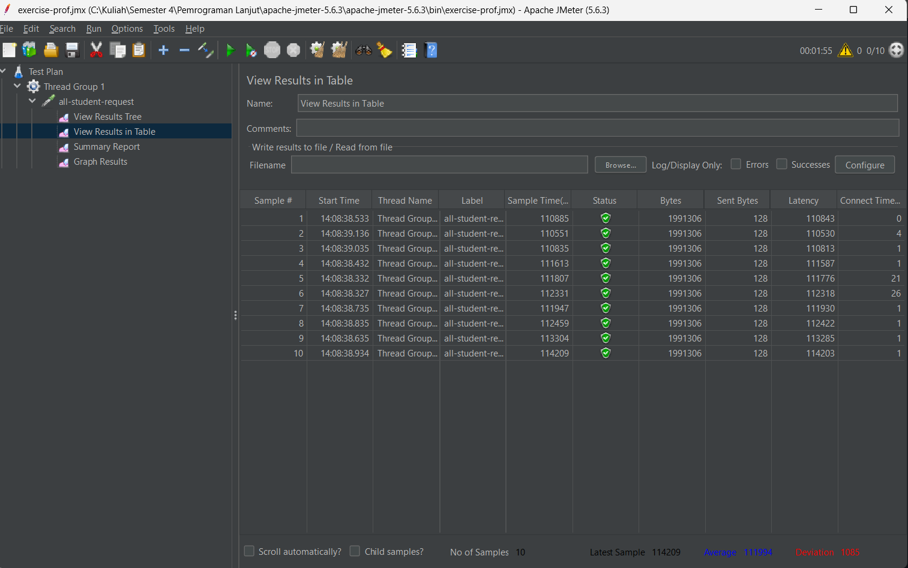
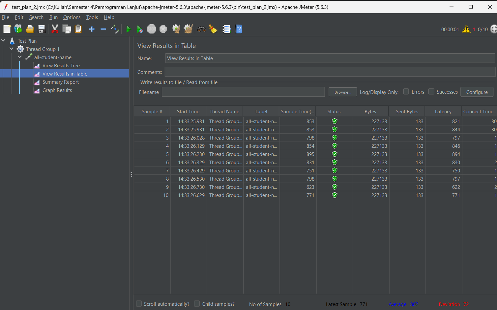
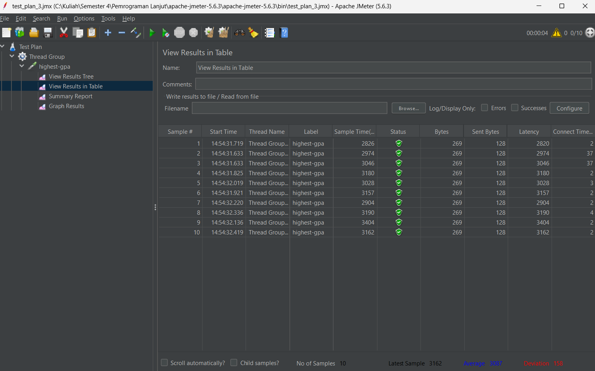
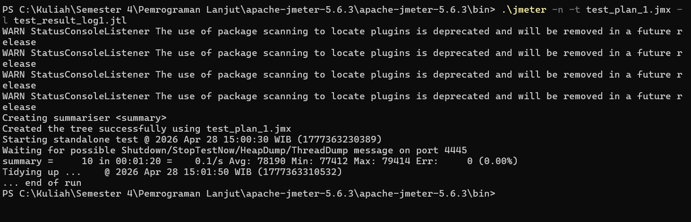
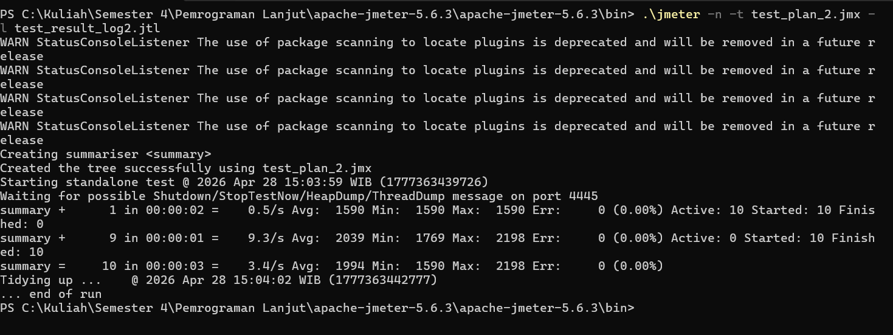
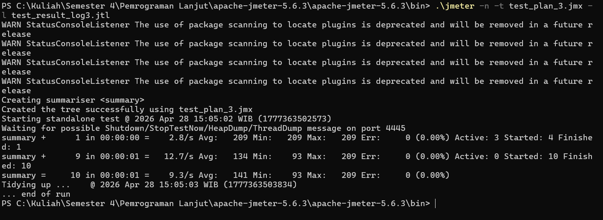
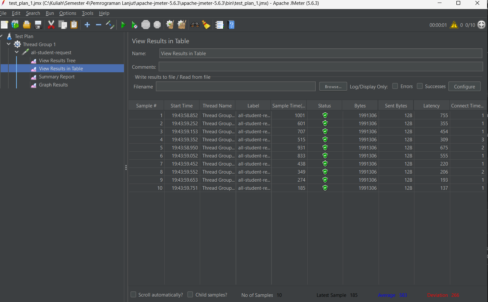
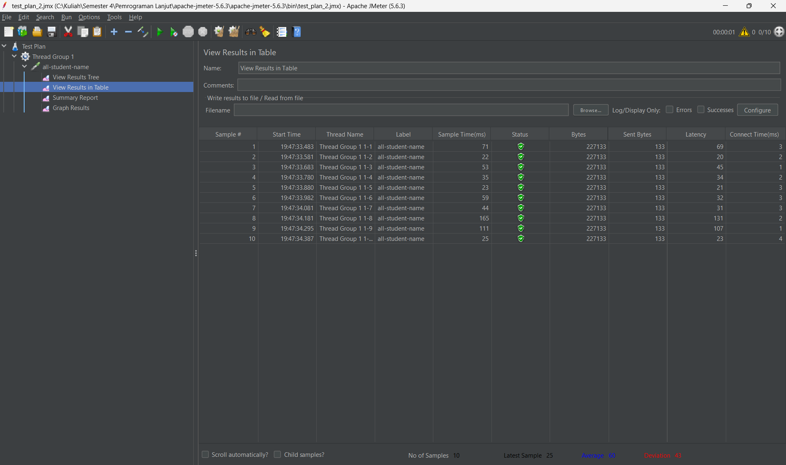
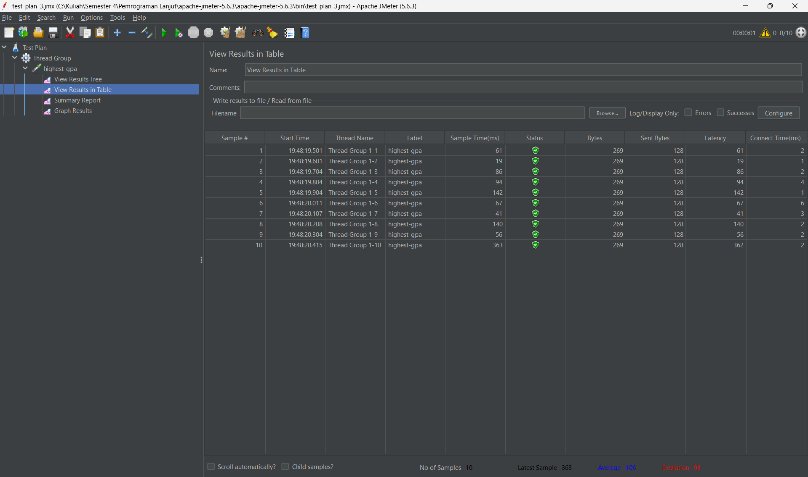

# Exercise Profiling

## Unoptimized Result

The following results were collected before optimization.
The raw JMeter logs, screenshots, and summary CSV file are saved under `Jmeter/UNOPTIMIZED`.

| Endpoint            | Samples |  Average |      Min |      Max | Std. Dev. | Error % |   Throughput | Avg. Bytes |
| ------------------- | ------: | -------: | -------: | -------: | --------: | ------: | -----------: | ---------: |
| `/all-student`      |      10 | 78190 ms | 77412 ms | 79414 ms |    539.54 |  0.000% |  0.12538/sec |  1991306.0 |
| `/all-student-name` |      10 |  1995 ms |  1590 ms |  2198 ms |    183.99 |  0.000% |  3.71609/sec |   227133.0 |
| `/highest-gpa`      |      10 |   142 ms |    93 ms |   209 ms |     38.81 |  0.000% | 10.90513/sec |      269.0 |

Summary CSV: [unoptimized-summary.csv](Jmeter/UNOPTIMIZED/unoptimized-summary.csv)

### Screenshots

SUMMARY `/all-student`



SUMMARY `/all-student-name`



SUMMARY `/highest-gpa`



### CLI Results

CLI RESULT `/all-student`



CLI RESULT `/all-student-name`



CLI RESULT `/highest-gpa`



### Raw Result Files

RAW RESULT `/all-student`: [test_result_log1.jtl](Jmeter/UNOPTIMIZED/1-all-student-request/test_result_log1.jtl)

|     timeStamp | elapsed | label               | responseCode | threadName          | success |   bytes | sentBytes | Latency | Connect |
| ------------: | ------: | ------------------- | -----------: | ------------------- | ------- | ------: | --------: | ------: | ------: |
| 1777363231014 |   77704 | all-student-request |          200 | Thread Group 1 1-5  | true    | 1991306 |       128 |   77660 |       1 |
| 1777363230915 |   77803 | all-student-request |          200 | Thread Group 1 1-4  | true    | 1991306 |       128 |   77774 |       1 |
| 1777363230814 |   78033 | all-student-request |          200 | Thread Group 1 1-3  | true    | 1991306 |       128 |   78014 |       1 |
| 1777363231515 |   77412 | all-student-request |          200 | Thread Group 1 1-10 | true    | 1991306 |       128 |   77395 |       2 |
| 1777363230769 |   78391 | all-student-request |          200 | Thread Group 1 1-1  | true    | 1991306 |       128 |   78374 |      28 |
| 1777363231215 |   78150 | all-student-request |          200 | Thread Group 1 1-7  | true    | 1991306 |       128 |   78120 |       1 |
| 1777363231413 |   77960 | all-student-request |          200 | Thread Group 1 1-9  | true    | 1991306 |       128 |   77924 |       2 |
| 1777363230771 |   78727 | all-student-request |          200 | Thread Group 1 1-2  | true    | 1991306 |       128 |   78682 |      32 |
| 1777363231313 |   78307 | all-student-request |          200 | Thread Group 1 1-8  | true    | 1991306 |       128 |   78288 |       2 |
| 1777363231115 |   79414 | all-student-request |          200 | Thread Group 1 1-6  | true    | 1991306 |       128 |   79389 |       2 |

RAW RESULT `/all-student-name`: [test_result_log2.jtl](Jmeter/UNOPTIMIZED/2-all-student-name/test_result_log2.jtl)

|     timeStamp | elapsed | label            | responseCode | threadName          | success |  bytes | sentBytes | Latency | Connect |
| ------------: | ------: | ---------------- | -----------: | ------------------- | ------- | -----: | --------: | ------: | ------: |
| 1777363440218 |    1590 | all-student-name |          200 | Thread Group 1 1-4  | true    | 227133 |       133 |    1574 |       1 |
| 1777363440082 |    1853 | all-student-name |          200 | Thread Group 1 1-1  | true    | 227133 |       133 |    1851 |      32 |
| 1777363440081 |    2064 | all-student-name |          200 | Thread Group 1 1-2  | true    | 227133 |       133 |    2062 |      33 |
| 1777363440125 |    2138 | all-student-name |          200 | Thread Group 1 1-3  | true    | 227133 |       133 |    2136 |       1 |
| 1777363440316 |    2097 | all-student-name |          200 | Thread Group 1 1-5  | true    | 227133 |       133 |    2096 |       2 |
| 1777363440416 |    2115 | all-student-name |          200 | Thread Group 1 1-6  | true    | 227133 |       133 |    2113 |      26 |
| 1777363440847 |    1769 | all-student-name |          200 | Thread Group 1 1-10 | true    | 227133 |       133 |    1767 |      20 |
| 1777363440515 |    2198 | all-student-name |          200 | Thread Group 1 1-7  | true    | 227133 |       133 |    2196 |       2 |
| 1777363440747 |    2023 | all-student-name |          200 | Thread Group 1 1-9  | true    | 227133 |       133 |    2021 |      10 |
| 1777363440671 |    2101 | all-student-name |          200 | Thread Group 1 1-8  | true    | 227133 |       133 |    2099 |      19 |

RAW RESULT `/highest-gpa`: [test_result_log3.jtl](Jmeter/UNOPTIMIZED/3-highest-gpa/test_result_log3.jtl)

|     timeStamp | elapsed | label       | responseCode | threadName        | success | bytes | sentBytes | Latency | Connect |
| ------------: | ------: | ----------- | -----------: | ----------------- | ------- | ----: | --------: | ------: | ------: |
| 1777363502913 |     209 | highest-gpa |          200 | Thread Group 1-2  | true    |   269 |       128 |     205 |      26 |
| 1777363502913 |     209 | highest-gpa |          200 | Thread Group 1-1  | true    |   269 |       128 |     205 |      26 |
| 1777363502991 |     153 | highest-gpa |          200 | Thread Group 1-3  | true    |   269 |       128 |     153 |       2 |
| 1777363503092 |     109 | highest-gpa |          200 | Thread Group 1-4  | true    |   269 |       128 |     108 |       1 |
| 1777363503190 |      93 | highest-gpa |          200 | Thread Group 1-5  | true    |   269 |       128 |      93 |       1 |
| 1777363503289 |     132 | highest-gpa |          200 | Thread Group 1-6  | true    |   269 |       128 |     131 |       1 |
| 1777363503389 |     113 | highest-gpa |          200 | Thread Group 1-7  | true    |   269 |       128 |     113 |       1 |
| 1777363503488 |     115 | highest-gpa |          200 | Thread Group 1-8  | true    |   269 |       128 |     115 |       1 |
| 1777363503594 |     161 | highest-gpa |          200 | Thread Group 1-9  | true    |   269 |       128 |     161 |       1 |
| 1777363503709 |     121 | highest-gpa |          200 | Thread Group 1-10 | true    |   269 |       128 |     121 |       1 |

## Optimized Result

The following results were collected after optimizing the endpoint implementations.
The raw JMeter logs and summary CSV file are saved under `Jmeter/OPTIMIZED`.

| Endpoint            | Samples | Average |   Min |    Max | Std. Dev. | Error % |   Throughput | Avg. Bytes |
| ------------------- | ------: | ------: | ----: | -----: | --------: | ------: | -----------: | ---------: |
| `/all-student`      |      10 |  180 ms | 70 ms | 394 ms |    126.19 |  0.000% | 11.70960/sec |  1991306.0 |
| `/all-student-name` |      10 |   28 ms | 12 ms |  75 ms |     21.61 |  0.000% | 12.04819/sec |   227133.0 |
| `/highest-gpa`      |      10 |   30 ms | 13 ms |  71 ms |     24.27 |  0.000% | 11.69591/sec |      269.0 |

Summary CSV: [optimized-summary.csv](Jmeter/OPTIMIZED/optimized-summary.csv)

## Optimization Method

| Endpoint            | Bottleneck Utama                                                                                                                                                                                                                           | Metode Optimisasi                                                                                                                                                                                                                                                                                                |
| ------------------- | ------------------------------------------------------------------------------------------------------------------------------------------------------------------------------------------------------------------------------------------ | ---------------------------------------------------------------------------------------------------------------------------------------------------------------------------------------------------------------------------------------------------------------------------------------------------------------- |
| `/all-student`      | Implementasi awal mengambil semua student terlebih dahulu, lalu melakukan query data course untuk setiap student. Hal ini menyebabkan query berulang dan data entity yang dimuat lebih banyak dari kebutuhan endpoint.                     | Mengganti pencarian per student menjadi satu query join antara `StudentCourse`, `Student`, dan `Course`. Query mengembalikan DTO ringan `StudentCourseSummary` yang hanya berisi `studentName` dan `courseName`. Response kemudian dibentuk dengan `StringBuilder` agar proses pembentukan string lebih efisien. |
| `/all-student-name` | Implementasi awal mengambil semua nama student ke Java lalu menggabungkannya satu per satu di application code. Hal ini membuat aplikasi melakukan pekerjaan string processing yang sebenarnya bisa dilakukan lebih efisien oleh database. | Memindahkan proses penggabungan nama ke PostgreSQL menggunakan `string_agg`, sehingga database langsung mengembalikan string akhir yang sudah dipisahkan dengan koma.                                                                                                                                            |
| `/highest-gpa`      | Implementasi awal mengambil seluruh data student lalu mencari GPA tertinggi di Java. Hal ini tidak efisien karena endpoint hanya membutuhkan satu student dengan GPA tertinggi.                                                            | Mengganti proses scan di Java dengan `findFirstByOrderByGpaDesc()`, sehingga database langsung mengembalikan satu row paling atas berdasarkan GPA. Hasilnya menggunakan projection `StudentSummary` agar aplikasi tidak perlu memproses full entity.                                                             |

## Performance Comparison

| Endpoint            | Before Average | After Average | Improvement | Speedup |
| ------------------- | -------------: | ------------: | ----------: | ------: |
| `/all-student`      |       78190 ms |        180 ms |      99.77% | 434.39x |
| `/all-student-name` |        1995 ms |         28 ms |      98.60% |  71.25x |
| `/highest-gpa`      |         142 ms |         30 ms |      78.87% |   4.73x |

### Screenshots

SUMMARY `/all-student`



SUMMARY `/all-student-name`



SUMMARY `/highest-gpa`



### Raw Result Files

RAW RESULT `/all-student`: [1-all-student-request-test-result-optimized.jtl](Jmeter/OPTIMIZED/1-all-student-request/1-all-student-request-test-result-optimized.jtl)

|     timeStamp | elapsed | label               | responseCode | threadName          | success |   bytes | sentBytes | Latency | Connect |
| ------------: | ------: | ------------------- | -----------: | ------------------- | ------- | ------: | --------: | ------: | ------: |
| 1777369226159 |     387 | all-student-request |          200 | Thread Group 1 1-1  | true    | 1991306 |       128 |     360 |      21 |
| 1777369226359 |     194 | all-student-request |          200 | Thread Group 1 1-4  | true    | 1991306 |       128 |     160 |       2 |
| 1777369226159 |     394 | all-student-request |          200 | Thread Group 1 1-2  | true    | 1991306 |       128 |     360 |      22 |
| 1777369226245 |     308 | all-student-request |          200 | Thread Group 1 1-3  | true    | 1991306 |       128 |     274 |      10 |
| 1777369226450 |     125 | all-student-request |          200 | Thread Group 1 1-5  | true    | 1991306 |       128 |     117 |       2 |
| 1777369226543 |      83 | all-student-request |          200 | Thread Group 1 1-6  | true    | 1991306 |       128 |      78 |       1 |
| 1777369226643 |      82 | all-student-request |          200 | Thread Group 1 1-7  | true    | 1991306 |       128 |      68 |       1 |
| 1777369226744 |      87 | all-student-request |          200 | Thread Group 1 1-8  | true    | 1991306 |       128 |      73 |       1 |
| 1777369226842 |      74 | all-student-request |          200 | Thread Group 1 1-9  | true    | 1991306 |       128 |      70 |       1 |
| 1777369226943 |      70 | all-student-request |          200 | Thread Group 1 1-10 | true    | 1991306 |       128 |      64 |       1 |

RAW RESULT `/all-student-name`: [2-all-student-name-test-result-optimized.jtl](Jmeter/OPTIMIZED/2-all-student-name/2-all-student-name-test-result-optimized.jtl)

|     timeStamp | elapsed | label            | responseCode | threadName          | success |  bytes | sentBytes | Latency | Connect |
| ------------: | ------: | ---------------- | -----------: | ------------------- | ------- | -----: | --------: | ------: | ------: |
| 1777369329473 |      64 | all-student-name |          200 | Thread Group 1 1-2  | true    | 227133 |       133 |      59 |      10 |
| 1777369329462 |      75 | all-student-name |          200 | Thread Group 1 1-1  | true    | 227133 |       133 |      71 |      22 |
| 1777369329573 |      15 | all-student-name |          200 | Thread Group 1 1-3  | true    | 227133 |       133 |      15 |       2 |
| 1777369329673 |      12 | all-student-name |          200 | Thread Group 1 1-4  | true    | 227133 |       133 |      11 |       1 |
| 1777369329773 |      28 | all-student-name |          200 | Thread Group 1 1-5  | true    | 227133 |       133 |      28 |       1 |
| 1777369329872 |      21 | all-student-name |          200 | Thread Group 1 1-6  | true    | 227133 |       133 |      20 |       1 |
| 1777369329974 |      13 | all-student-name |          200 | Thread Group 1 1-7  | true    | 227133 |       133 |      13 |       2 |
| 1777369330076 |      13 | all-student-name |          200 | Thread Group 1 1-8  | true    | 227133 |       133 |      12 |       1 |
| 1777369330176 |      16 | all-student-name |          200 | Thread Group 1 1-9  | true    | 227133 |       133 |      14 |       1 |
| 1777369330274 |      18 | all-student-name |          200 | Thread Group 1 1-10 | true    | 227133 |       133 |      16 |       1 |

RAW RESULT `/highest-gpa`: [3-highest-gpa-test-result-optimize.jtl](Jmeter/OPTIMIZED/3-highest-gpa/3-highest-gpa-test-result-optimize.jtl)

|     timeStamp | elapsed | label       | responseCode | threadName        | success | bytes | sentBytes | Latency | Connect |
| ------------: | ------: | ----------- | -----------: | ----------------- | ------- | ----: | --------: | ------: | ------: |
| 1777369388497 |      71 | highest-gpa |          200 | Thread Group 1-2  | true    |   269 |       128 |      66 |      21 |
| 1777369388497 |      70 | highest-gpa |          200 | Thread Group 1-1  | true    |   269 |       128 |      66 |      21 |
| 1777369388590 |      13 | highest-gpa |          200 | Thread Group 1-3  | true    |   269 |       128 |      13 |       1 |
| 1777369388690 |      15 | highest-gpa |          200 | Thread Group 1-4  | true    |   269 |       128 |      15 |       1 |
| 1777369388789 |      15 | highest-gpa |          200 | Thread Group 1-5  | true    |   269 |       128 |      15 |       1 |
| 1777369388890 |      13 | highest-gpa |          200 | Thread Group 1-6  | true    |   269 |       128 |      13 |       1 |
| 1777369388989 |      14 | highest-gpa |          200 | Thread Group 1-7  | true    |   269 |       128 |      14 |       1 |
| 1777369389088 |      13 | highest-gpa |          200 | Thread Group 1-8  | true    |   269 |       128 |      13 |       1 |
| 1777369389188 |      14 | highest-gpa |          200 | Thread Group 1-9  | true    |   269 |       128 |      13 |       1 |
| 1777369389294 |      58 | highest-gpa |          200 | Thread Group 1-10 | true    |   269 |       128 |      58 |       2 |

### Conclusion

Hasil pengujian JMeter setelah optimisasi menunjukkan peningkatan performa yang sangat jelas dibandingkan pengukuran awal. Endpoint `/all-student` mengalami peningkatan paling besar karena aplikasi tidak lagi melakukan pencarian course berulang untuk setiap student dan tidak lagi memuat entity yang tidak diperlukan. Endpoint `/all-student-name` juga menjadi jauh lebih cepat karena proses penggabungan nama dipindahkan ke database, sehingga aplikasi cukup menerima hasil akhir. Endpoint `/highest-gpa` ikut membaik karena aplikasi tidak lagi melakukan scan seluruh student di Java, tetapi langsung meminta database mengembalikan student dengan GPA tertinggi. Dari hasil ini, menurut saya optimisasi yang dilakukan berhasil karena average response time turun pada semua endpoint dan error rate tetap berada di `0.000%`.

## Reflection

1. Menurut saya, perbedaan utama antara performance testing dengan JMeter dan profiling dengan IntelliJ Profiler ada pada sudut pandangnya. JMeter melihat performa aplikasi dari luar, seperti pengguna atau client yang mengirim request ke endpoint. Dari JMeter kita bisa melihat response time, throughput, latency, error rate, dan seberapa stabil aplikasi ketika menerima beberapa request. Sementara itu, IntelliJ Profiler melihat aplikasi dari dalam. Profiler membantu melihat method mana yang paling banyak memakan total time dan CPU time. Jadi JMeter membantu menunjukkan endpoint mana yang lambat, sedangkan IntelliJ Profiler membantu menjelaskan bagian kode mana yang menyebabkan endpoint tersebut menjadi lambat.

2. Proses profiling sangat membantu karena kita tidak perlu menebak-nebak bagian mana yang menjadi penyebab utama performa buruk. Dari hasil profiler, kita bisa melihat method yang paling lama berjalan dan method mana yang paling sering dipanggil. Dalam kasus ini, profiling membantu saya memahami bahwa masalah performa bukan hanya berasal dari endpoint yang berat, tetapi dari cara data diambil dan diproses di service. Misalnya ada method yang mengambil terlalu banyak data, melakukan query berulang, atau melakukan proses penggabungan string di aplikasi. Dengan informasi itu, proses optimisasi menjadi lebih terarah.

3. IntelliJ Profiler cukup efektif untuk membantu menganalisis dan menemukan bottleneck pada kode aplikasi. Tool ini tidak hanya memberi tahu bahwa aplikasi lambat, tetapi juga menunjukkan method mana yang paling berpengaruh terhadap waktu eksekusi. Hal ini penting karena hasil JMeter saja hanya menunjukkan bahwa suatu endpoint lambat, tetapi tidak langsung menunjukkan penyebab di dalam kode. Dengan profiler, saya bisa membuka method yang bermasalah, melihat alurnya, lalu menentukan bagian mana yang perlu diubah. Jadi optimisasi tidak dilakukan secara asal, tetapi berdasarkan bukti dari proses profiling.

4. Menurut saya, tantangan utama saat melakukan performance testing dan profiling adalah menjaga kondisi pengujian tetap konsisten. Hasil response time bisa berubah karena jumlah data di database, kondisi aplikasi yang baru dijalankan, proses lain yang berjalan di background, atau database yang sedang berat. Selain itu, membaca hasil profiling juga perlu hati-hati karena total time dan CPU time tidak selalu berarti hal yang sama. Saya mengatasinya dengan menggunakan jumlah sample yang sama, menjaga data pengujian tetap konsisten, menjalankan ulang test setelah optimisasi, dan membandingkan hasil JMeter dengan hasil profiler sebelum menarik kesimpulan.

5. Menurut saya, manfaat utama dari IntelliJ Profiler adalah kita bisa melihat apa yang sebenarnya terjadi di dalam aplikasi saat request diproses. Profiler membantu membedakan apakah masalah performa berasal dari logic yang berat, akses database yang terlalu banyak, object creation yang tidak perlu, atau loop yang kurang efisien. Dalam project ini, profiler membantu memperjelas bahwa beberapa endpoint lambat karena data yang diambil terlalu besar atau prosesnya dilakukan di Java padahal bisa dibuat lebih efisien melalui query database. Dengan begitu, perubahan kode yang dilakukan menjadi lebih tepat sasaran.

6. Menurut saya, jika hasil profiling dari IntelliJ Profiler tidak sepenuhnya sama dengan hasil JMeter, hal pertama yang perlu dilakukan adalah memahami bahwa kedua tool ini mengukur hal yang berbeda. JMeter mengukur performa end-to-end dari sisi request, termasuk waktu database, response size, network, dan proses server mengirim response. Sementara itu, IntelliJ Profiler lebih fokus pada method di dalam aplikasi. Jadi jika hasilnya berbeda, saya akan mengecek kemungkinan bottleneck berada di luar method Java, misalnya query database yang lama, ukuran response yang besar, koneksi database, atau kondisi environment saat test. Saya juga akan mengulang pengujian supaya hasilnya tidak hanya dipengaruhi noise sementara.

7. Strategi utama setelah menganalisis hasil JMeter dan profiling adalah mengurangi pekerjaan yang tidak perlu dilakukan aplikasi. Pada project ini, strategi yang saya gunakan adalah mengurangi query berulang, mengambil hanya data yang dibutuhkan endpoint, memakai projection atau DTO ringan, memindahkan operasi agregasi tertentu ke database, dan mengganti proses string yang kurang efisien dengan pendekatan yang lebih sesuai. Untuk memastikan perubahan tidak merusak fungsionalitas, saya tetap menjaga format response agar sama, melakukan compile, menjalankan ulang performance test dengan JMeter, dan membandingkan hasil sebelum serta sesudah optimisasi. Jika error rate tetap `0.000%` dan response tetap sesuai, maka perubahan tersebut bisa dianggap aman.

## Project Run

### Run Project

Run project with Docker Compose:

```bash
docker compose up --build
```

Run in background:

```bash
docker compose up --build -d
```

Stop project:

```bash
docker compose down
```

Alternative run with Maven, if PostgreSQL is already running on `localhost:5433`:

On Windows Command Prompt or PowerShell:

```powershell
.\mvnw.cmd spring-boot:run
```

On Git Bash, Linux, or macOS:

```bash
./mvnw spring-boot:run
```

Application URL:

```text
http://localhost:8080
```

### Seed Data

Seed students and courses:

```powershell
Invoke-WebRequest http://localhost:8080/seed-data-master
```

Seed student-course relations:

```powershell
Invoke-WebRequest http://localhost:8080/seed-student-course
```

Alternative with curl:

```bash
curl http://localhost:8080/seed-data-master
curl http://localhost:8080/seed-student-course
```

### Troubleshooting

If Spring Boot fails with `Port 8080 was already in use`, another app is already running on port `8080`.

Check which process uses port `8080` on Windows PowerShell:

```powershell
Get-NetTCPConnection -LocalPort 8080 -State Listen | Select-Object LocalAddress,LocalPort,OwningProcess
```

Stop the process by replacing `<PID>` with the `OwningProcess` value:

```powershell
Stop-Process -Id <PID>
```

If the port is used by the Docker app container, stop only the app container and keep PostgreSQL running:

```bash
docker compose stop app
```

If you want to stop all containers:

```bash
docker compose down
```

Note: PostgreSQL uses port `5433` in this project, so `Port 8080 was already in use` is usually caused by the Spring Boot app, not PostgreSQL.
